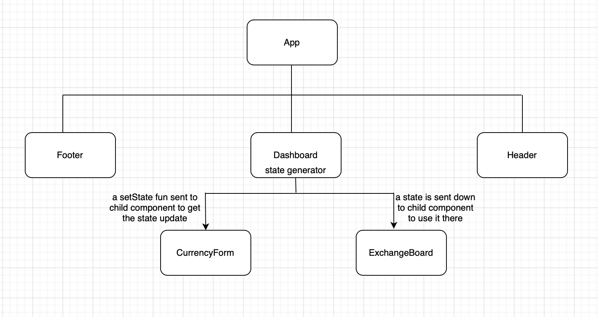

# About The Project

A powerful simple currency converter, Currency provides up-to-date exchange rates for over 16 currencies and countries! Relay on fetching currencies from third-party api.

# Built Using

**- Integrated Development Environment (IDE)**

 

**- Programming Languages**

         

# Usage

A Simple diagram for work flow

# Roadmap

A full list of proposed features
- [x] Select from a range of Currencies
- [x] Convert any amount into USD 

# Key Concepts

1.	State management
2.	React components
3.	React-bootstrap styling
4.	Side Effects Handling

# Contribution

If you have a suggestion that would make this better, please fork the repo and create a pull request. You can also simply open an issue with the tag "enhancement". Don't forget to give the project a star! Thanks again!

1. Fork the Project
2. Create your Feature Branch (git checkout -b feature/AmazingFeature)
3. Commit your Changes (git commit -m 'Add some AmazingFeature')
4. Push to the Branch (git push origin feature/AmazingFeature)
5. Open a Pull Request

# Contact

I am Niveen, MERN developer and 

<a href="https://niveen-abdelaatty.github.io/JS-Memory-Game/" target="_blank">You can visit my game by hitting this link</a>

# Acknowledgments

I've included a few of helpful resources to kick things off!

[- Free Currency Api](https://freecurrencyapi.com/)

[- Check a key in an object](https://www.freecodecamp.org/news/how-to-check-if-an-object-has-a-key-in-javascript/)
